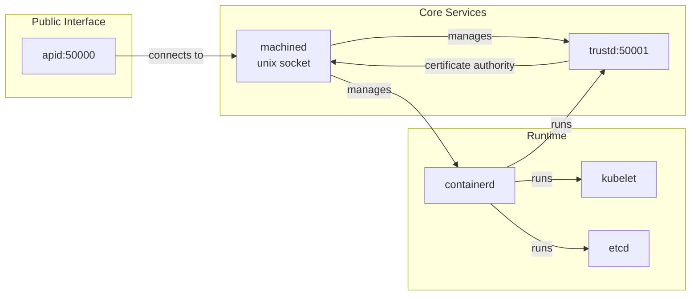

Talos Linux is composed of several specialized components that work together to provide a secure, API-driven platform for Kubernetes. Each component runs with minimal privileges and has a well-defined purpose.

## Component Overview



## machined

`machined` is the heart of Talos Linux - the system controller that manages the entire node lifecycle.

### Responsibilities

- **Boot orchestration** - Executes boot sequence tasks in order
- **Service management** - Starts, stops, and monitors system services
- **Configuration management** - Applies and validates machine config
- **Controller runtime** - Runs COSI controllers for state reconciliation
- **API implementation** - Implements the Machine Service API
- **Event system** - Publishes system events for monitoring

### Implementation Details

From `internal/app/machined/pkg/system/services/machined.go:34`:

```go
const machinedServiceID = "machined"

type machinedService struct {
    c runtime.Controller
}
```

`machined` runs as a goroutine (not in a container) and exposes a Unix socket at `/run/machined/machined.sock` with restricted permissions:

- Socket owned by `apid` user for secure access
- SELinux label applied for additional isolation
- RBAC enforced at the API layer

### Service Management

Services are managed through a dependency graph defined by the `DependsOn()` interface. For example:

- `containerd` has no dependencies (starts first)
- `apid` depends on `containerd`
- `kubelet` depends on `cri` (containerd CRI plugin)
- `etcd` depends on `cri`

### Health Checking

Services implementing `HealthcheckedService` are continuously monitored:

```go
func (m *Machined) HealthFunc(runtime.Runtime) health.Check {
    return func(ctx context.Context) error {
        var d net.Dialer
        conn, err := d.DialContext(ctx, "unix", constants.MachineSocketPath)
        if err != nil {
            return err
        }
        return conn.Close()
    }
}
```

## apid

`apid` is the public-facing API server that handles all external communication with Talos nodes.

### Responsibilities

- **API gateway** - Exposes gRPC services on port 50000
- **Authentication** - Validates client certificates (mTLS)
- **Authorization** - Enforces role-based access control
- **Request proxying** - Forwards requests to `machined` via Unix socket
- **Multi-node operations** - Can proxy requests to other cluster members

### Implementation Details

From `internal/app/machined/pkg/system/services/apid.go:46`:

```go
type APID struct {
    runtimeServer *grpc.Server
}

func (o *APID) ID(r runtime.Runtime) string {
    return "apid"
}
```

`apid` runs as a containerized service with:

- **Minimal privileges** - All capabilities dropped except necessary ones
- **Network namespace** - Shares host network for API access
- **Read-only root** - Container filesystem is immutable
- **Resource limits** - Memory limit via `GOMEMLIMIT` environment variable

### Resource Filtering

From `internal/app/machined/pkg/system/services/apid.go:57-74`, `apid` has filtered access to the COSI state:

```go
func apidResourceFilter(_ context.Context, access state.Access) error {
    if !access.Verb.Readonly() {
        return errors.New("write access denied")
    }
    
    switch {
    case access.ResourceNamespace == secrets.NamespaceName && 
         access.ResourceType == secrets.APIType:
        // allowed, contains apid certificates
    case access.ResourceNamespace == network.NamespaceName && 
         access.ResourceType == network.NodeAddressType:
        // allowed, contains local node addresses
    default:
        return errors.New("access denied")
    }
}
```

This ensures `apid` can only access its own certificates and network information, following the principle of least privilege.

### API Ports

| Port | Service | Purpose |
|------|---------|----------|
| 50000 | apid | Main Talos API (gRPC) |
| 50001 | trustd | Certificate signing (mTLS) |

## trustd

`trustd` is Talos's built-in certificate authority that handles PKI operations for the cluster.

### Responsibilities

- **Certificate authority** - Signs certificate requests for cluster components
- **Token validation** - Validates bootstrap tokens for new nodes
- **Certificate issuance** - Issues certificates for nodes joining the cluster
- **Root of trust** - Maintains the cluster CA and root certificates

### Implementation Details

From `internal/app/machined/pkg/system/services/trustd.go:43-54`:

```go
type Trustd struct {
    runtimeServer *grpc.Server
}

func (t *Trustd) ID(runtime.Runtime) string {
    return "trustd"
}
```

`trustd` runs as a containerized service with strict isolation:

- **Minimal capabilities** - All capabilities dropped
- **User ID isolation** - Runs as dedicated `trustd` user
- **Filtered resource access** - Only accesses secrets in `secrets.TrustdType`
- **Time synchronization dependency** - Waits for NTP sync before starting

### Bootstrap Flow

When a new node joins:

1. Node generates ephemeral key pair
2. Connects to `trustd` with bootstrap token
3. `trustd` validates token and issues certificates
4. Node uses certificates for all future API calls

## containerd

Talos uses containerd as its container runtime for both system services and Kubernetes workloads.

### Responsibilities

- **Container lifecycle** - Start, stop, and manage containers
- **Image management** - Pull and store container images
- **CRI implementation** - Provides CRI interface for kubelet
- **Namespace isolation** - Separates system containers from Kubernetes pods

### Implementation Details

From `internal/app/machined/pkg/system/services/containerd.go:87-100`:

```go
func (c *Containerd) Runner(r runtime.Runtime) (runner.Runner, error) {
    args := &runner.Args{
        ID: c.ID(r),
        ProcessArgs: []string{
            "/bin/containerd",
            "--address", constants.SystemContainerdAddress,
            "--state", filepath.Join(constants.SystemRunPath, "containerd"),
            "--root", filepath.Join(constants.SystemVarPath, "lib", "containerd"),
        },
    }
    // ...
}
```

### Namespaces

Talos uses containerd namespaces to separate concerns:

- `system` - Talos system services (apid, trustd, etcd)
- `k8s.io` - Kubernetes pods and containers

### Socket Locations

- **System containerd**: `/run/containerd/containerd.sock`
- **CRI containerd**: `/run/containerd/containerd.sock` (same instance, different namespace)

### Health Checking

containerd health is verified through its gRPC health service:

```go
func (c *Containerd) HealthFunc(runtime.Runtime) health.Check {
    return func(ctx context.Context) error {
        client, err := c.Client()
        resp, err := client.HealthService().Check(ctx, 
            &grpc_health_v1.HealthCheckRequest{})
        if resp.Status != grpc_health_v1.HealthCheckResponse_SERVING {
            return fmt.Errorf("unexpected serving status: %d", resp.Status)
        }
        return nil
    }
}
```

## kubelet

The kubelet runs as a system container managed by Talos, connecting the node to the Kubernetes cluster.

### Implementation Details

From `internal/app/machined/pkg/system/services/kubelet.go:128-215`:

The kubelet runs with extensive privileges required for pod management:

- **Host networking** - Shares host network namespace
- **Host PID namespace** - Can see host processes
- **Device access** - Full access to `/dev`
- **Shared mount propagation** - Required for volume mounts
- **Most capabilities** - Needs elevated permissions for container operations

<Warning>
  The kubelet is one of the most privileged components in Talos. While necessary for Kubernetes operations, this is why Talos focuses on hardening the layers below the kubelet.
</Warning>

### Key Mounts

- `/etc/kubernetes` - Kubelet config and credentials
- `/var/lib/kubelet` - Pod data and volumes
- `/var/lib/containerd` - Container runtime state
- `/sys/fs/cgroup` - cgroup management
- `/dev` - Device access for volumes

### Health Check

Kubelet health is checked via its healthz endpoint:

```go
func (k *Kubelet) HealthFunc(runtime.Runtime) health.Check {
    return func(ctx context.Context) error {
        return simpleHealthCheck(ctx, "http://127.0.0.1:10248/healthz")
    }
}
```

## etcd

etcd runs on control plane nodes only, providing distributed consensus for Kubernetes.

### Implementation Details

From `internal/app/machined/pkg/system/services/etcd.go:60-78`:

```go
type Etcd struct {
    Bootstrap            bool
    RecoverFromSnapshot  bool
    RecoverSkipHashCheck bool
    
    args   []string
    client *etcd.Client
    imgRef string
    learnerMemberID uint64
    promoteCtxCancel context.CancelFunc
}
```

### Cluster Membership

Talos manages etcd cluster membership automatically:

1. **Init node**: Starts with `initial-cluster-state=new`
2. **Joining nodes**: Added as learners first, then promoted to voting members
3. **Member removal**: Graceful shutdown removes member from cluster
4. **Learner promotion**: Automatic after member catches up with leader

### Storage

etcd data is stored on the `EPHEMERAL` partition at `/var/lib/etcd`:

- Data persists across reboots
- Wiped during reset operations
- Backed up via snapshot mechanism

### High Availability

From `internal/app/machined/pkg/system/services/etcd.go:588-631`, Talos handles learner member promotion:

```go
func promoteMember(ctx context.Context, r runtime.Runtime, memberID uint64) error {
    return retry.Constant(10*time.Minute,
        retry.WithUnits(15*time.Second),
        retry.WithAttemptTimeout(30*time.Second),
    ).RetryWithContext(ctx, func(ctx context.Context) error {
        // Iterate all endpoints to find one that works
        // Promote the learner to voting member
    })
}
```

## System Services

Talos includes minimal system services for basic operations:

### udevd

Device manager for hardware events:
- Detects new hardware
- Creates device nodes in `/dev`
- Triggers loading of kernel modules

### syslogd

Minimal logging daemon:
- Receives kernel logs
- Routes to appropriate destinations
- No persistent logs (logs go to memory buffer)

### registryd

Manages system extensions and image overlays:
- Loads system extensions from configured sources
- Manages extension lifecycle
- Provides extension metadata

<Note>
  Unlike traditional Linux distributions, Talos services are designed to be ephemeral and stateless where possible.
</Note>

## Service Runner Types

Talos uses different runner types for different service needs:

### Process Runner

Runs services as host processes (e.g., containerd):
- Direct execution on host
- Managed by machined
- Restart policies applied

### Containerd Runner

Runs services in containers (e.g., kubelet, etcd, apid):
- OCI spec generated dynamically
- Namespace isolation
- Resource limits enforced

### Goroutine Runner

Runs services as Go goroutines (e.g., machined internal services):
- Lightweight
- Shared memory space
- Fast startup

## Resource Management

All services have resource constraints:

- **OOM scores**: Critical services get negative scores to avoid OOM kills
  - `containerd`: -999 (most protected)
  - `apid`, `trustd`: -998
  - `kubelet`: -996
- **Memory limits**: Set via `GOMEMLIMIT` for Go services
- **Cgroup paths**: Each service in its own cgroup for isolation

## Next Steps

<CardGroup cols={2}>
  <Card title="Security Model" icon="shield" href="/architecture/security-model">
    Learn how these components are secured
  </Card>
  <Card title="Networking" icon="network-wired" href="/architecture/networking">
    Understand network architecture
  </Card>
</CardGroup>
