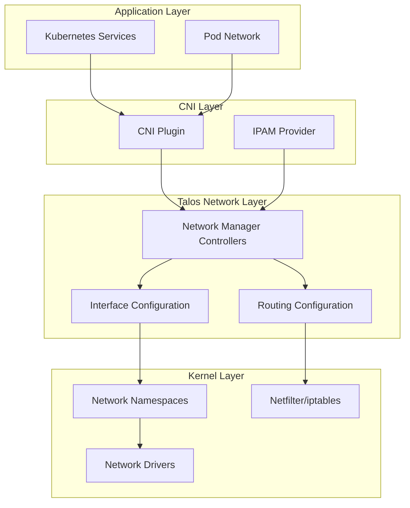
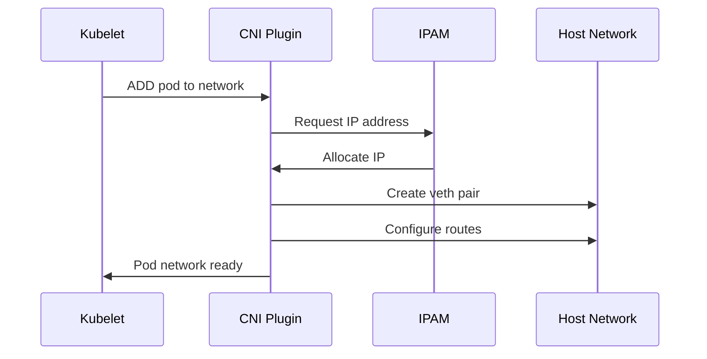

Talos Linux provides a robust, declarative network configuration system designed for Kubernetes workloads. Network configuration is fully managed through the machine config, with no runtime modifications possible.

## Network Stack Overview

Talos networking consists of several layers that work together:



## Network Configuration

Network configuration is declared in the machine config and managed by Talos controllers.

### Basic Interface Configuration

```yaml
machine:
  network:
    hostname: worker-1
    interfaces:
      - interface: eth0
        dhcp: true
        vip:
          ip: 10.0.0.100
      - interface: eth1
        addresses:
          - 192.168.1.10/24
        routes:
          - network: 0.0.0.0/0
            gateway: 192.168.1.1
        mtu: 9000
```

### Advanced Configurations

<AccordionGroup>
  <Accordion title="VLAN Configuration">
    ```yaml
    machine:
      network:
        interfaces:
          - interface: eth0.100
            vlanId: 100
            addresses:
              - 10.0.100.10/24
          - interface: eth0.200
            vlanId: 200
            addresses:
              - 10.0.200.10/24
    ```
  </Accordion>
  
  <Accordion title="Bond Configuration">
    ```yaml
    machine:
      network:
        interfaces:
          - interface: bond0
            bond:
              mode: 802.3ad
              lacpRate: fast
              interfaces:
                - eth0
                - eth1
            addresses:
              - 10.0.0.10/24
    ```
  </Accordion>
  
  <Accordion title="Bridge Configuration">
    ```yaml
    machine:
      network:
        interfaces:
          - interface: br0
            bridge:
              stp:
                enabled: true
              interfaces:
                - eth0
                - eth1
            addresses:
              - 10.0.0.10/24
    ```
  </Accordion>
  
  <Accordion title="Wireguard VPN">
    ```yaml
    machine:
      network:
        interfaces:
          - interface: wg0
            wireguard:
              privateKey: ${WG_PRIVATE_KEY}
              listenPort: 51820
              peers:
                - publicKey: ${PEER_PUBLIC_KEY}
                  endpoint: peer.example.com:51820
                  allowedIPs:
                    - 10.1.0.0/16
            addresses:
              - 10.1.0.1/24
    ```
  </Accordion>
</AccordionGroup>

## Network Resource Management (COSI)

Talos manages network state through COSI resources in the `network` namespace.

### Key Network Resources

| Resource Type | Purpose | Example |
|---------------|---------|----------|
| `AddressSpec` | Desired IP addresses | Interface addresses, VIPs |
| `AddressStatus` | Current IP addresses | Actual configured addresses |
| `RouteSpec` | Desired routes | Static routes, default gateway |
| `RouteStatus` | Current routing table | Active kernel routes |
| `LinkSpec` | Interface configuration | MTU, bonding, VLANs |
| `LinkStatus` | Interface state | Link up/down, speed, duplex |
| `HostnameSpec` | Hostname configuration | Node hostname |
| `HostnameStatus` | Current hostname | Resolved hostname |
| `ResolverSpec` | DNS configuration | Nameservers, search domains |
| `NodeAddress` | Node addresses | Filtered addresses for k8s |

### Network Controllers

Talos runs multiple controllers to reconcile network state:

- **AddressConfigController** - Applies IP addresses to interfaces
- **RouteConfigController** - Manages routing table
- **LinkConfigController** - Configures interface properties
- **HostnameConfigController** - Sets system hostname
- **ResolverConfigController** - Manages DNS resolution
- **EtcFileController** - Generates /etc/hosts and /etc/resolv.conf

## DNS Resolution

### DNS Configuration

```yaml
machine:
  network:
    nameservers:
      - 8.8.8.8
      - 1.1.1.1
    extraHostEntries:
      - ip: 192.168.1.100
        aliases:
          - internal.example.com
          - db.internal.example.com
```

### DNS Resolution Flow

1. **Application** queries DNS
2. **systemd-resolved** (if enabled) or direct resolution
3. **Nameservers** from machine config or DHCP
4. **Search domains** applied automatically
5. **Response** returned to application

<Info>
  Talos generates `/etc/resolv.conf` and `/etc/hosts` dynamically from network resources. Manual edits are not persisted.
</Info>

## CNI (Container Network Interface)

Talos supports any standard CNI plugin for Kubernetes pod networking.

### CNI Architecture



### Popular CNI Plugins with Talos

<CardGroup cols={2}>
  <Card title="Cilium" icon="network-wired">
    eBPF-based networking with observability
    - High performance
    - Network policies
    - Service mesh (optional)
    - Hubble observability
  </Card>
  
  <Card title="Calico" icon="shield">
    Network policy and security
    - BGP routing
    - Network policies
    - WireGuard encryption
    - eBPF dataplane option
  </Card>
  
  <Card title="Flannel" icon="layer-group">
    Simple overlay networking
    - Easy setup
    - VXLAN or host-gw
    - Lightweight
    - Good for small clusters
  </Card>
  
  <Card title="Multus" icon="plug">
    Multiple network interfaces
    - Multiple CNIs per pod
    - SR-IOV support
    - DPDK support
    - Network selection
  </Card>
</CardGroup>

### CNI Configuration Location

CNI configurations are stored in `/etc/cni/net.d/` and managed by your CNI provider:

```bash
/etc/cni/
├── net.d/
│   └── 10-calico.conflist
└── bin/
    ├── calico
    ├── calico-ipam
    └── bandwidth
```

<Warning>
  Do not manually modify CNI configurations. These are managed by the CNI plugin's DaemonSet.
</Warning>

## Service Discovery

### Kubernetes Service Types

Talos supports all Kubernetes service types:

#### ClusterIP Services

- Virtual IP managed by kube-proxy or CNI
- Only accessible within cluster
- Load balanced to endpoints

#### NodePort Services

```yaml
apiVersion: v1
kind: Service
metadata:
  name: my-service
spec:
  type: NodePort
  ports:
    - port: 80
      targetPort: 8080
      nodePort: 30080
```

Accessible on all nodes at `<NodeIP>:30080`

#### LoadBalancer Services

Requires a LoadBalancer controller (MetalLB, cloud provider):

```yaml
apiVersion: v1
kind: Service
metadata:
  name: my-service
spec:
  type: LoadBalancer
  ports:
    - port: 80
      targetPort: 8080
  loadBalancerIP: 10.0.0.100
```

#### ExternalName Services

DNS CNAME for external services:

```yaml
apiVersion: v1
kind: Service
metadata:
  name: external-db
spec:
  type: ExternalName
  externalName: db.example.com
```

## Load Balancing

### MetalLB with Talos

MetalLB provides LoadBalancer services in bare metal environments:

1. **Layer 2 Mode** - Responds to ARP requests
2. **BGP Mode** - Announces routes via BGP

```yaml
apiVersion: v1
kind: ConfigMap
metadata:
  namespace: metallb-system
  name: config
data:
  config: |
    address-pools:
    - name: default
      protocol: layer2
      addresses:
      - 10.0.0.100-10.0.0.200
```

### Virtual IP (VIP) Configuration

Talos supports Virtual IPs for high availability:

```yaml
machine:
  network:
    interfaces:
      - interface: eth0
        dhcp: true
        vip:
          ip: 10.0.0.100  # Shared IP for control plane
          equinixMetal:
            apiToken: ${METAL_API_TOKEN}
```

VIP support for:
- **Equinix Metal** - API-managed VIP
- **HCloud** - Hetzner Cloud floating IP
- **Layer 2** - Standard VRRP/ARP-based VIP

## Service Mesh Integration

Talos is fully compatible with service mesh implementations.

### Istio

Istio works seamlessly with Talos:

```bash
istioctl install --set profile=default
```

Key considerations:
- CNI plugin compatible with Istio CNI
- Proper network policies configured
- Ingress gateway exposed via LoadBalancer or NodePort

### Linkerd

Linkerd lightweight service mesh:

```bash
linkerd install --crds | kubectl apply -f -
linkerd install | kubectl apply -f -
```

Works out-of-the-box with Talos, no special configuration needed.

### Cilium Service Mesh

Cilium provides integrated service mesh:

```yaml
apiVersion: v1
kind: ConfigMap
metadata:
  name: cilium-config
  namespace: kube-system
data:
  enable-envoy-config: "true"
  enable-ingress-controller: "true"
```

## Firewall Configuration

Talos supports nftables-based firewall rules:

```yaml
machine:
  network:
    firewall:
      defaultAction: block
      rules:
        - name: kubelet-api
          portSelector:
            ports:
              - 10250
          ingress:
            - subnet: 10.0.0.0/8
        - name: apid
          portSelector:
            ports:
              - 50000
          ingress:
            - subnet: 0.0.0.0/0
```

### Default Ports

| Port | Service | Access |
|------|---------|--------|
| 50000 | Talos API (apid) | Configure as needed |
| 50001 | trustd | Control plane only |
| 6443 | Kubernetes API | Load balancer / external |
| 2379-2380 | etcd | Control plane only |
| 10250 | kubelet | Cluster internal |
| 10251 | kube-scheduler | Localhost only |
| 10252 | kube-controller | Localhost only |
| 10256 | kube-proxy | Metrics |

<Note>
  Firewall rules are evaluated in order. The first matching rule determines the action.
</Note>

## Network Policies

Kubernetes Network Policies control pod-to-pod communication:

```yaml
apiVersion: networking.k8s.io/v1
kind: NetworkPolicy
metadata:
  name: deny-all-ingress
spec:
  podSelector: {}
  policyTypes:
    - Ingress
---
apiVersion: networking.k8s.io/v1
kind: NetworkPolicy
metadata:
  name: allow-from-namespace
spec:
  podSelector:
    matchLabels:
      app: backend
  policyTypes:
    - Ingress
  ingress:
    - from:
      - namespaceSelector:
          matchLabels:
            name: frontend
```

<Warning>
  Network policies require a CNI that supports them (Cilium, Calico, etc.). Not all CNIs enforce network policies.
</Warning>

## IPv6 Support

Talos supports dual-stack IPv4/IPv6 networking:

```yaml
machine:
  network:
    interfaces:
      - interface: eth0
        addresses:
          - 10.0.0.10/24
          - 2001:db8::10/64
        routes:
          - network: ::/0
            gateway: 2001:db8::1
```

### Dual-Stack Kubernetes

Enable dual-stack in cluster config:

```yaml
cluster:
  network:
    podSubnets:
      - 10.244.0.0/16
      - 2001:db8:1::/56
    serviceSubnets:
      - 10.96.0.0/12
      - 2001:db8:2::/112
```

## Network Troubleshooting

### Diagnostic Commands

```bash
# Check interface status
talosctl get links

# View IP addresses
talosctl get addresses

# Check routes
talosctl get routes
talosctl routes

# DNS resolution
talosctl get resolvers

# Network connectivity
talosctl netstat
talosctl read /proc/net/tcp

# Packet capture
talosctl pcap -i eth0
```

### Common Issues

<AccordionGroup>
  <Accordion title="Pods Can't Reach Internet">
    1. Check default route: `talosctl routes`
    2. Verify DNS: `talosctl get resolvers`
    3. Check NAT/masquerading in CNI config
    4. Verify firewall rules don't block outbound
  </Accordion>
  
  <Accordion title="Pod-to-Pod Communication Fails">
    1. Check CNI plugin status: `kubectl get pods -n kube-system`
    2. Verify pod CIDR doesn't conflict with node network
    3. Check network policies: `kubectl get networkpolicies`
    4. Verify MTU settings match across infrastructure
  </Accordion>
  
  <Accordion title="Can't Access Talos API">
    1. Verify mTLS certificates: `talosctl version`
    2. Check firewall rules allow port 50000
    3. Verify network connectivity: `ping <node-ip>`
    4. Check apid service: `talosctl service apid`
  </Accordion>
  
  <Accordion title="LoadBalancer Service Pending">
    1. Verify LoadBalancer controller installed: `kubectl get pods -n metallb-system`
    2. Check controller logs
    3. Verify IP pool configuration
    4. Check Layer 2 mode announces ARP correctly
  </Accordion>
</AccordionGroup>

## Network Performance

### Optimization Tips

1. **MTU Configuration** - Set MTU to 9000 for 10GbE networks:
   ```yaml
   machine:
     network:
       interfaces:
         - interface: eth0
           mtu: 9000
   ```

2. **RSS (Receive Side Scaling)** - Enable for multi-queue NICs

3. **CNI Selection** - Choose based on needs:
   - **Highest performance**: Cilium eBPF or Calico eBPF
   - **Simplicity**: Flannel
   - **Features**: Cilium with Hubble

4. **Network Policies** - Can impact performance, use sparingly

5. **Kernel Parameters** - Tune for high throughput:
   ```yaml
   machine:
     sysctls:
       net.core.rmem_max: 134217728
       net.core.wmem_max: 134217728
       net.ipv4.tcp_rmem: "4096 87380 67108864"
       net.ipv4.tcp_wmem: "4096 65536 67108864"
   ```

## Best Practices

<CardGroup cols={2}>
  <Card title="Use Static IPs" icon="hashtag">
    For control plane nodes, use static IP addresses to avoid DNS dependencies during bootstrap
  </Card>
  
  <Card title="Separate Networks" icon="split">
    Use separate networks for management (Talos API) and data plane (Kubernetes)
  </Card>
  
  <Card title="Enable Network Policies" icon="shield">
    Implement network policies for zero-trust security between pods
  </Card>
  
  <Card title="Monitor MTU" icon="ruler">
    Ensure consistent MTU across all infrastructure to avoid fragmentation
  </Card>
  
  <Card title="Plan IP Ranges" icon="map">
    Allocate sufficient IP ranges for pods and services before deployment
  </Card>
  
  <Card title="Document Firewall Rules" icon="file-lines">
    Keep firewall rules documented and minimal for security and troubleshooting
  </Card>
</CardGroup>

## Next Steps

<CardGroup cols={2}>
  <Card title="CNI Installation" icon="puzzle-piece" href="/guides/network/cni">
    Install and configure CNI plugins
  </Card>
  <Card title="Load Balancer Setup" icon="scale-balanced" href="/guides/network/load-balancer">
    Configure MetalLB or cloud load balancer
  </Card>
  <Card title="VIP Configuration" icon="circle-dot" href="/guides/network/vip">
    Set up Virtual IP for control plane HA
  </Card>
  <Card title="Security Model" icon="shield" href="/architecture/security-model">
    Learn about Talos network security
  </Card>
</CardGroup>
