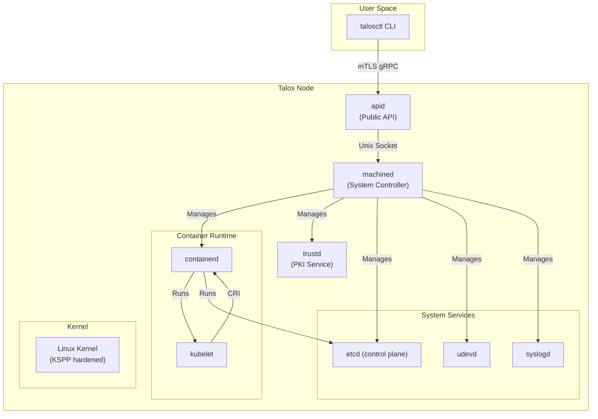

Talos Linux is a modern operating system designed from the ground up for running Kubernetes. It embraces immutability, API-driven operations, and security-first principles to deliver a predictable, minimal, and hardened platform.

## Design Principles

Talos Linux is built on three core principles that differentiate it from traditional Linux distributions:

### Security First

- **No SSH or shell access** - All system management happens through a secure API
- **Mutual TLS (mTLS) authentication** - Every API call is authenticated and encrypted
- **Immutable root filesystem** - The system partition is read-only, preventing runtime modifications
- **Minimal attack surface** - No package manager, no unnecessary services, no persistent logs on disk
- **Hardened by default** - KSPP (Kernel Self Protection Project) parameters enforced at boot

### Predictable Operations

- **Immutable infrastructure** - Systems are replaced, not modified
- **Declarative configuration** - Machine config defines the desired state
- **Atomic updates** - A/B partition scheme enables safe rollbacks
- **No configuration drift** - Every machine starts from the same immutable image

### API-Driven Management

- **Everything through gRPC** - No SSH, no shell, no imperative commands
- **Role-based access control** - Admin, Operator, Reader, and specialized roles
- **Real-time event streaming** - Watch system events as they happen
- **Programmatic by design** - Easy to automate and integrate

## System Architecture

Talos Linux consists of several core components that work together to provide a complete Kubernetes platform:



## Boot Process

Talos Linux follows a carefully orchestrated boot sequence that ensures all dependencies are met before services start:

### Boot Stages

1. **Early Boot**
   - Kernel initialization with KSPP parameters
   - Root filesystem mounted as read-only
   - Hardware detection and module loading

2. **Configuration Acquisition**
   - Machine config loaded from disk, network, or platform metadata
   - Config validation and contract checking
   - Secrets generation or retrieval

3. **Network Initialization**
   - Network interfaces configured
   - Hostname resolution
   - Time synchronization

4. **Service Startup**
   - `containerd` starts first (base container runtime)
   - `apid` and `trustd` start (API and PKI services)
   - `kubelet` starts on all nodes
   - `etcd` starts on control plane nodes

5. **Kubernetes Cluster**
   - Control plane components start
   - Node joins the cluster
   - Workloads can be scheduled

### Sequencer Tasks

The boot process is managed by a sequencer that executes tasks in order. Key tasks include:

- `WaitForUSB` - Waits for USB storage devices to be detected
- `EnforceKSPPRequirements` - Applies kernel security parameters
- `LoadConfig` - Acquires and validates machine configuration
- `StartServices` - Brings up system services with dependency resolution

From source: `internal/app/machined/pkg/runtime/v1alpha1/v1alpha1_sequencer_tasks.go`

## Storage Layout

Talos uses a specific partition layout designed for immutable operations:

<Note>
  Talos uses an A/B partition scheme for the root filesystem, enabling atomic updates with automatic rollback on failure.
</Note>

| Partition | Purpose | Mutable |
|-----------|---------|----------|
| EFI System | Boot loader and kernel images | Updated during upgrades |
| BOOT-A | System partition A | Immutable (read-only) |
| BOOT-B | System partition B | Immutable (read-only) |
| STATE | Machine configuration and PKI | Mutable |
| EPHEMERAL | Runtime data, container images | Mutable |

### A/B Updates

When upgrading Talos:

1. New system image written to inactive partition (A or B)
2. Bootloader updated to point to new partition
3. System reboots into new partition
4. If boot fails, bootloader automatically falls back to previous partition
5. After successful boot, old partition becomes the standby

## Configuration Model

Talos uses a declarative configuration model defined in the machine config:

```yaml
version: v1alpha1
machine:
  type: controlplane  # or worker
  network:
    hostname: control-plane-1
    interfaces:
      - interface: eth0
        dhcp: true
cluster:
  clusterName: my-cluster
  controlPlane:
    endpoint: https://control-plane.example.com:6443
```

<Info>
  The machine config is the single source of truth for a Talos node. It's validated against a schema and can be patched programmatically.
</Info>

Key configuration sections:

- **Machine config** - Node-specific settings (networking, disks, sysctls)
- **Cluster config** - Kubernetes cluster settings shared across nodes
- **Install config** - Disk layout and installation parameters

Configuration is immutable once applied - changes require a new config to be applied through the API.

## Controller Runtime (COSI)

Talos uses COSI (Common Operating System Interface) as its internal state management system:

- **Resources** - Typed objects representing system state (network, runtime, secrets)
- **Controllers** - Reconcile desired state with actual state
- **Dependency graph** - Controllers declare dependencies for proper ordering
- **Event-driven** - Controllers react to resource changes in real-time

Example resources:
- `network.AddressStatus` - Network interface addresses
- `secrets.API` - API server certificates
- `k8s.KubeletSpec` - Kubelet configuration
- `etcd.Spec` - etcd cluster settings

This architecture allows Talos to manage complex system state declaratively, similar to how Kubernetes manages workloads.

## Next Steps

<CardGroup cols={2}>
  <Card title="Core Components" icon="cube" href="/architecture/components">
    Deep dive into machined, apid, containerd, and other system services
  </Card>
  <Card title="Security Model" icon="shield" href="/architecture/security-model">
    Learn about Talos security architecture and mTLS authentication
  </Card>
  <Card title="Networking" icon="network-wired" href="/architecture/networking">
    Understand network architecture and CNI integration
  </Card>
  <Card title="API Reference" icon="book" href="/reference/api">
    Explore the complete Talos API
  </Card>
</CardGroup>
