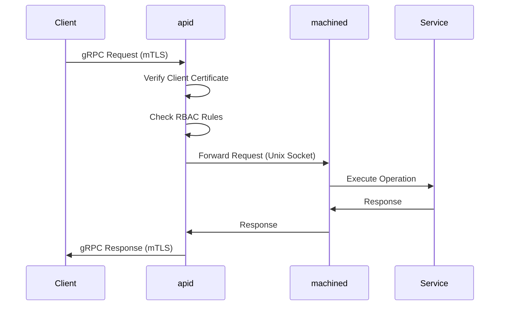
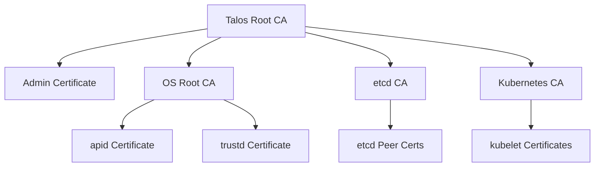

Talos Linux implements a defense-in-depth security model that eliminates traditional attack vectors while maintaining operational flexibility. Every design decision prioritizes security without compromising functionality.

## Core Security Principles

Talos security is built on five foundational principles:

1. **No SSH** - Shell access is an attack vector, not a feature
2. **Immutable infrastructure** - Systems cannot be modified at runtime
3. **API-only access** - All operations go through authenticated, authorized API calls
4. **Mutual TLS everywhere** - Every connection is authenticated and encrypted
5. **Minimal attack surface** - No unnecessary services, packages, or binaries

<Warning>
  There is no "break glass" mechanism in Talos. If you lose your API credentials, you must rebuild the node. This is by design.
</Warning>

## No SSH, No Shell

Talos Linux does not include SSH, bash, or any interactive shell by design.

### Why No SSH?

SSH introduces security risks that are incompatible with Talos's security model:

- **Attack surface** - SSH daemons are frequent targets for exploitation
- **Credential management** - SSH keys require secure distribution and rotation
- **Audit trail** - Interactive sessions are difficult to audit comprehensively
- **Configuration drift** - Shell access enables imperative changes that cause drift
- **Privilege escalation** - sudo and root access are common escalation targets

### What Replaces SSH?

Every operation that traditionally required SSH is available through the API:

| SSH Use Case | Talos Alternative |
|--------------|-------------------|
| View logs | `talosctl logs` or `talosctl dmesg` |
| Edit files | Update machine config and apply via API |
| Check processes | `talosctl processes` |
| Network troubleshooting | `talosctl netstat`, `talosctl routes` |
| Restart services | `talosctl service restart` |
| Debug containers | `talosctl debug` (launches ephemeral pod) |

<Info>
  For emergency debugging, Talos supports ephemeral debug containers that self-destruct after use. These are launched via the API and fully audited.
</Info>

## Immutable Root Filesystem

The Talos root filesystem is mounted read-only and cannot be modified at runtime.

### Implementation

- **Immutable system partition** - BOOT-A and BOOT-B partitions are read-only
- **No package manager** - Cannot install or modify software
- **No configuration files** - System configured via machine config only
- **Controlled mutable space** - Only STATE and EPHEMERAL partitions are writable

### Benefits

1. **Prevents persistence** - Malware cannot modify the system
2. **Eliminates drift** - Every node boots to identical state
3. **Enables rollback** - A/B partitions allow instant recovery
4. **Simplifies validation** - System integrity verified at boot

### What Is Mutable?

| Path | Mutable | Purpose |
|------|---------|----------|
| `/` | No | System binaries and libraries |
| `/etc` | Partially | Generated configs (kubelet, etcd) |
| `/var/lib` | Yes | Container images, etcd data |
| `/var/log` | In-memory | Ephemeral logs (not persisted) |
| `/run` | In-memory | Runtime state and sockets |
| `/system/state` | Yes | Machine config and PKI |

## API-Only Access Model

All Talos operations are performed through gRPC APIs secured with mutual TLS.

### API Architecture



### Authentication Flow

1. **Client certificate** - Client presents X.509 certificate
2. **CA verification** - Certificate signed by Talos CA
3. **Role extraction** - Roles embedded in certificate organization field
4. **Authorization** - RBAC rules checked for requested operation
5. **Execution** - If authorized, operation proceeds

### Role-Based Access Control

From `internal/app/machined/internal/server/v1alpha1/v1alpha1_server.go`, Talos implements fine-grained RBAC:

```go
var rules = map[string]role.Set{
    "/machine.MachineService/ApplyConfiguration": role.MakeSet(role.Admin),
    "/machine.MachineService/Bootstrap":          role.MakeSet(role.Admin),
    "/machine.MachineService/Reboot":             role.MakeSet(role.Admin, role.Operator),
    "/machine.MachineService/Version":            role.MakeSet(role.Admin, role.Operator, role.Reader),
    "/machine.MachineService/Logs":               role.MakeSet(role.Admin, role.Operator, role.Reader),
}
```

#### Built-in Roles

<AccordionGroup>
  <Accordion title="Admin Role">
    Full access to all operations:
    - Apply configuration changes
    - Reset and wipe nodes
    - Upgrade Talos version
    - Manage etcd cluster
    - All read and restart operations
  </Accordion>
  
  <Accordion title="Operator Role">
    Day-to-day operations without destructive actions:
    - Restart services
    - View logs and metrics
    - Reboot nodes
    - Manage containers
    - Cannot: Reset, upgrade, or modify config
  </Accordion>
  
  <Accordion title="Reader Role">
    Read-only access for monitoring:
    - View system information
    - Read logs
    - Check service status
    - Get metrics
    - Cannot: Modify anything
  </Accordion>
  
  <Accordion title="EtcdBackup Role">
    Specialized role for backup systems:
    - Take etcd snapshots
    - Check etcd status
    - List etcd members
    - Cannot: Modify etcd or other services
  </Accordion>
</AccordionGroup>

## Mutual TLS (mTLS)

Every API connection in Talos uses mutual TLS for authentication and encryption.

### Certificate Hierarchy



### Certificate Storage

Certificates are stored in the STATE partition and managed through COSI resources:

- `secrets.API` - apid certificates (read by apid only)
- `secrets.Trustd` - trustd certificates (read by trustd only)
- `secrets.Etcd` - etcd CA and certificates
- `secrets.Kubernetes` - Kubernetes component certificates

From `internal/app/machined/pkg/system/services/apid.go:56-74`, resource filtering ensures isolation:

```go
func apidResourceFilter(_ context.Context, access state.Access) error {
    if !access.Verb.Readonly() {
        return errors.New("write access denied")
    }
    
    switch {
    case access.ResourceType == secrets.APIType:
        // apid can only read its own certificates
        return nil
    default:
        return errors.New("access denied")
    }
}
```

### Certificate Rotation

Talos supports online certificate rotation:

1. Generate new certificates
2. Apply updated machine config with new certs
3. Services reload certificates without downtime
4. Old certificates can be revoked

## Privilege Separation

Talos components run with minimal privileges using multiple isolation mechanisms.

### User Isolation

Services run as dedicated users with minimal privileges:

```go
const (
    ApidUserID   = 1000  // apid runs as uid 1000
    TrustdUserID = 1001  // trustd runs as uid 1001
    EtcdUserID   = 1002  // etcd runs as uid 1002
)
```

### Capability Dropping

From `internal/app/machined/pkg/system/services/apid.go:213`, most capabilities are dropped:

```go
runner.WithOCISpecOpts(
    oci.WithDroppedCapabilities(cap.Known()),  // Drop all capabilities
    oci.WithHostNamespace(specs.NetworkNamespace),
    oci.WithRootFSReadonly(),  // Read-only root filesystem
)
```

### SELinux Labels

When SELinux is enabled, services get dedicated labels:

- `constants.SelinuxLabelApid` - apid container label
- `constants.SelinuxLabelTrustd` - trustd container label
- `constants.SelinuxLabelKubelet` - kubelet container label
- `constants.SelinuxLabelSystemRuntime` - containerd label

### OOM Score Adjustment

Critical services protected from OOM killer:

```go
runner.WithOOMScoreAdj(-999)  // containerd: most protected
runner.WithOOMScoreAdj(-998)  // apid, trustd: highly protected
runner.WithOOMScoreAdj(-996)  // kubelet: protected
```

## Kernel Hardening

Talos enforces Kernel Self Protection Project (KSPP) parameters at boot.

### KSPP Parameters Enforced

From `internal/app/machined/pkg/runtime/v1alpha1/v1alpha1_sequencer_tasks.go:118-126`:

```go
func EnforceKSPPRequirements(runtime.Sequence, any) (runtime.TaskExecutionFunc, string) {
    return func(ctx context.Context, logger *log.Logger, r runtime.Runtime) (err error) {
        if err = resourceruntime.NewKernelParamsSetCondition(
            r.State().V1Alpha2().Resources(), 
            kspp.GetKernelParams()...,
        ).Wait(ctx); err != nil {
            return err
        }
        
        return kspp.EnforceKSPPKernelParameters()
    }, "enforceKSPPRequirements"
}
```

Key hardening parameters:

- `kernel.kptr_restrict=1` - Hide kernel pointers
- `kernel.dmesg_restrict=1` - Restrict dmesg access
- `kernel.perf_event_paranoid=3` - Restrict perf events
- `kernel.yama.ptrace_scope=1` - Restrict ptrace
- `net.core.bpf_jit_harden=2` - Harden BPF JIT

## Attack Surface Reduction

Talos minimizes the attack surface by removing unnecessary components.

### Not Included in Talos

- ❌ SSH daemon
- ❌ Shell (bash, sh)
- ❌ Package manager (apt, yum)
- ❌ Init system (systemd, sysvinit)
- ❌ GUI or display server
- ❌ Compilers or dev tools
- ❌ Python, Perl, or scripting languages
- ❌ Unnecessary kernel modules
- ❌ Man pages or documentation files

### What Is Included

- ✅ Linux kernel (minimal config)
- ✅ containerd runtime
- ✅ Talos system services
- ✅ Minimal networking tools
- ✅ Required kernel modules only

### Binary Size Comparison

| Component | Size |
|-----------|------|
| Talos ISO | ~120 MB |
| Talos System Partition | ~90 MB |
| Ubuntu Server ISO | ~1.4 GB |
| RHEL CoreOS | ~800 MB |

<Note>
  Smaller size = fewer binaries = smaller attack surface = fewer CVEs to patch
</Note>

## Network Security

All network communication in Talos is encrypted and authenticated.

### Port Security

| Port | Service | Access |
|------|---------|--------|
| 50000 | apid (Talos API) | mTLS required |
| 50001 | trustd | mTLS required |
| 6443 | Kubernetes API | mTLS required |
| 2379-2380 | etcd | mTLS required, control plane only |
| 10250 | kubelet | TLS required |

<Warning>
  Talos does not respond to unauthenticated requests. There is no HTTP, no plaintext, and no anonymous access.
</Warning>

### Network Policies

Firewall rules can be configured in machine config:

```yaml
machine:
  network:
    firewall:
      defaultAction: block
      rules:
        - name: apid
          portSelector:
            ports:
              - 50000
          ingress:
            - subnet: 10.0.0.0/8
```

## Secure Boot (UEFI)

Talos supports UEFI Secure Boot for hardware-rooted trust:

1. **UEFI firmware** verifies bootloader signature
2. **Bootloader** verifies kernel and initramfs signatures
3. **Kernel** loads only signed kernel modules
4. **Talos** verifies system partition integrity

### Setting Up Secure Boot

1. Generate and enroll keys in UEFI
2. Sign Talos bootloader and kernel
3. Configure machine to boot only signed images
4. Enable in machine config:

```yaml
machine:
  install:
    secureboot: true
```

## Audit and Compliance

Talos provides comprehensive audit capabilities for compliance requirements.

### Event Stream

All operations generate events that can be streamed in real-time:

```bash
talosctl events --tail
```

Events include:
- Service state changes
- Configuration updates
- Network changes
- Container lifecycle
- Security events

### Audit Logs

Kubernetes audit logs can be configured:

```yaml
cluster:
  apiServer:
    auditPolicy:
      apiVersion: audit.k8s.io/v1
      kind: Policy
      rules:
        - level: RequestResponse
```

## Security Best Practices

<CardGroup cols={2}>
  <Card title="Rotate Certificates" icon="rotate">
    Regularly rotate API certificates and Kubernetes certificates
  </Card>
  
  <Card title="Limit Admin Access" icon="user-shield">
    Use Operator and Reader roles for day-to-day operations
  </Card>
  
  <Card title="Enable Secure Boot" icon="lock">
    Use UEFI Secure Boot for hardware-rooted trust
  </Card>
  
  <Card title="Monitor Events" icon="bell">
    Stream events to SIEM for security monitoring
  </Card>
  
  <Card title="Network Segmentation" icon="network-wired">
    Use firewall rules to restrict API access
  </Card>
  
  <Card title="Regular Updates" icon="arrow-up">
    Keep Talos updated for security patches
  </Card>
</CardGroup>

## Threat Model

Talos is designed to protect against:

### Mitigated Threats

- ✅ **SSH exploitation** - No SSH daemon to attack
- ✅ **Privilege escalation** - No shell or sudo
- ✅ **Persistent malware** - Immutable root filesystem
- ✅ **Configuration tampering** - API-only config changes
- ✅ **Lateral movement** - mTLS required for all connections
- ✅ **Supply chain attacks** - Signed images and Secure Boot

### Remaining Attack Vectors

- ⚠️ **Compromised credentials** - Protect talosconfig files
- ⚠️ **Kubernetes exploits** - Keep Kubernetes updated
- ⚠️ **Container escapes** - Use seccomp and AppArmor in pods
- ⚠️ **Physical access** - Use disk encryption and Secure Boot

## Compliance

Talos security features support compliance with:

- **CIS Kubernetes Benchmark** - Many controls built-in
- **PCI-DSS** - Immutability and audit logging
- **HIPAA** - Encryption and access controls
- **SOC 2** - Change management and monitoring
- **FedRAMP** - Hardening and FIPS mode support

<Info>
  Talos supports FIPS 140-2 mode for cryptographic operations when built with FIPS-enabled Go toolchain.
</Info>

## Next Steps

<CardGroup cols={2}>
  <Card title="Generate Certificates" icon="certificate" href="/guides/security/certificates">
    Learn how to generate and manage Talos certificates
  </Card>
  <Card title="RBAC Configuration" icon="users" href="/guides/security/rbac">
    Configure role-based access control
  </Card>
  <Card title="Network Security" icon="shield" href="/architecture/networking">
    Understand Talos network architecture
  </Card>
  <Card title="Audit Logging" icon="file-lines" href="/guides/security/audit-logs">
    Set up audit logging for compliance
  </Card>
</CardGroup>
