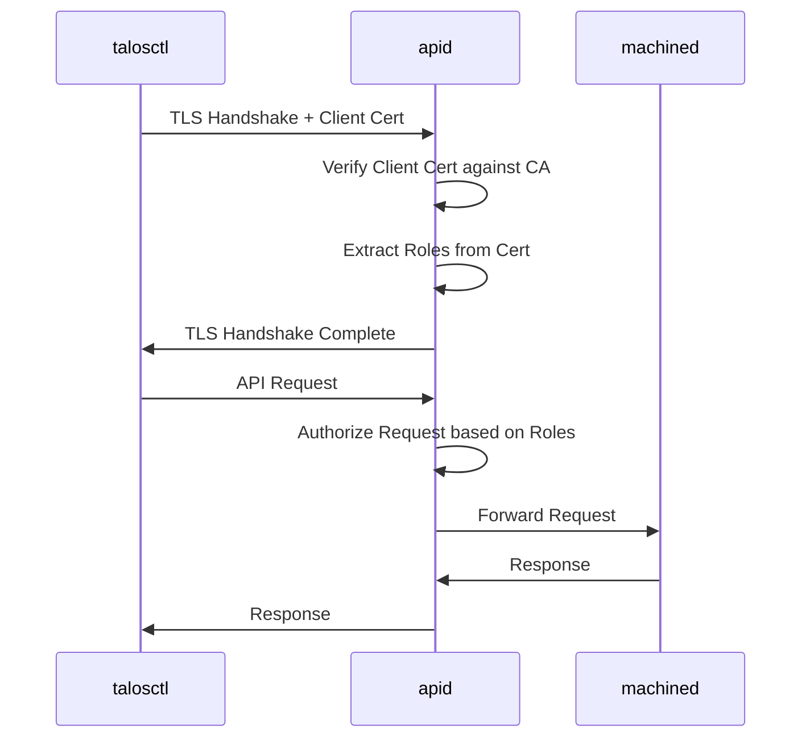
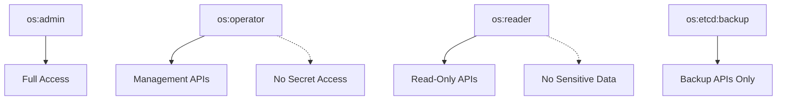

Talos uses mutual TLS (mTLS) for all API authentication, with role-based authorization to control access. This page explains how authentication works and how to manage access.

## Mutual TLS (mTLS) Authentication

Talos requires mutual TLS for all API communications:

- **Server authentication**: Client verifies the server's identity
- **Client authentication**: Server verifies the client's identity
- **Encryption**: All data is encrypted in transit
- **No passwords**: Authentication is certificate-based only

### How mTLS Works



**Steps:**

1. **TLS Handshake**: Client and server exchange certificates
2. **Certificate Verification**: Both sides verify certificates against their trusted CA
3. **Role Extraction**: Server extracts roles from client certificate's Organization field
4. **Authorization**: Server checks if roles permit the requested operation
5. **Encrypted Communication**: All data is encrypted with TLS 1.3

Implementation in `internal/app/apid/main.go:95` verifies client certificates.

### Certificate Requirements

Client certificates must have:

- **Issuer**: Signed by the Talos OS CA
- **Extended Key Usage**: Client Authentication
- **Organization**: One or more Talos roles (e.g., `os:admin`)
- **Validity**: Not expired

<Warning>
Client certificates without the "Client Authentication" extended key usage will be rejected. This is enforced at `internal/app/apid/main.go:265`.
</Warning>

## Talosconfig File

The `talosconfig` file stores client credentials and cluster configuration:

### Structure

**Example talosconfig:**

```yaml
context: my-cluster
contexts:
  my-cluster:
    # API endpoints
    endpoints:
      - 10.5.0.2
      - 10.5.0.3
    # Target nodes (optional, defaults to endpoints)
    nodes:
      - 10.5.0.4
      - 10.5.0.5
    # CA certificate (base64-encoded)
    ca: LS0tLS1CRUdJTiBDRVJUSUZJQ0FURS0tLS0t...
    # Client certificate (base64-encoded)
    crt: LS0tLS1CRUdJTiBDRVJUSUZJQ0FURS0tLS0t...
    # Client key (base64-encoded)
    key: LS0tLS1CRUdJTiBSU0EgUFJJVkFURSBLRVkt...
```

**Generated by:** `pkg/machinery/config/generate/talosconfig.go:12`

**Fields:**

- `context`: Active context name
- `contexts`: Map of named contexts
  - `endpoints`: Talos API endpoints (control plane nodes)
  - `nodes`: Target nodes for commands (defaults to endpoints)
  - `ca`: Talos OS CA certificate for verifying server certificates
  - `crt`: Client certificate for authentication
  - `key`: Client private key

<Note>
The `endpoints` should point to control plane nodes, while `nodes` can be any nodes in the cluster. If `nodes` is omitted, commands will target the `endpoints`.
</Note>

### Talosconfig Location

By default, `talosctl` looks for talosconfig in:

1. `--talosconfig` flag
2. `$TALOSCONFIG` environment variable
3. `~/.talos/config` (default location)

**Check current config:**

```bash
talosctl config info
```

**Output:**
```yaml
context: my-cluster
endpoints:
  - 10.5.0.2
nodes:
  - 10.5.0.4
ca: /home/user/.talos/config
crt: /home/user/.talos/config
key: /home/user/.talos/config
```

### Multiple Contexts

Manage multiple clusters in one talosconfig:

```yaml
context: production
contexts:
  production:
    endpoints:
      - 10.5.0.2
    ca: LS0tLS...
    crt: LS0tLS...
    key: LS0tLS...
  
  staging:
    endpoints:
      - 10.10.0.2
    ca: LS0tLS...
    crt: LS0tLS...
    key: LS0tLS...
```

**Switch contexts:**

```bash
# List contexts
talosctl config contexts

# Switch context
talosctl config context staging
```

### Merging Talosconfigs

Merge multiple talosconfigs:

```bash
# Merge another talosconfig into current
talosctl config merge other-cluster.yaml
```

This will:
- Add new contexts to your config
- Rename contexts if there are conflicts (e.g., `prod` becomes `prod-1`)
- Preserve your current context

See `pkg/machinery/client/config/config.go:211` for merge implementation.

## Role-Based Access Control

Talos implements RBAC using certificate-based roles:

### Built-in Roles

Defined in `pkg/machinery/role/role.go:14`:

#### os:admin

**Full administrative access**

- All API operations
- Read/write access
- Access to secrets and sensitive data
- Reboot, upgrade, reset operations

**Use for:** Cluster administrators, automation with full access

#### os:operator

**Operational access without secrets**

- Most management APIs
- Reboot, cordon, drain operations
- View logs and metrics
- **Cannot** access secrets or sensitive configuration

**Use for:** Operations teams, on-call personnel

#### os:reader

**Read-only access to non-sensitive data**

- View system status
- Read logs (non-sensitive)
- View resource state
- **Cannot** modify system or access secrets

**Use for:** Monitoring systems, developers, auditors

#### os:etcd:backup

**Permission to create etcd backups**

- Create etcd snapshots
- Download etcd backups
- Limited to backup operations

**Use for:** Backup automation, disaster recovery systems

#### os:impersonator

**Ability to impersonate other roles**

- Used internally by Talos
- Can be granted to users for role delegation
- Use with extreme caution

**Use for:** Advanced use cases, testing

### Role Hierarchy



### How Roles Work

Roles are encoded in the certificate's Organization field:

**Certificate with os:admin role:**
```
Subject: CN=talosctl-client
Subject: O=os:admin
```

**Certificate with multiple roles:**
```
Subject: CN=talosctl-client
Subject: O=os:operator
Subject: O=os:etcd:backup
```

**Authorization check (from `pkg/machinery/role/role.go:101`):**

1. Extract Organization fields from client certificate
2. Parse into role set
3. Check if role set includes required role for API
4. Allow if authorized, reject if not

## Generating Talosconfig

### During Cluster Creation

Generate talosconfig with cluster configs:

```bash
talosctl gen config my-cluster https://10.5.0.2:6443
```

**Output:**
- `controlplane.yaml` - Control plane node config
- `worker.yaml` - Worker node config
- `talosconfig` - Admin talosconfig with `os:admin` role

### From Existing Secrets

Generate talosconfig from secrets bundle:

```bash
talosctl gen config my-cluster https://10.5.0.2:6443 \
  --with-secrets secrets.yaml \
  --output-types talosconfig
```

### With Custom Roles

Generate talosconfig with specific roles:

```bash
talosctl gen config my-cluster https://10.5.0.2:6443 \
  --with-secrets secrets.yaml \
  --roles os:operator,os:etcd:backup \
  --output-types talosconfig
```

**Implementation:** `pkg/machinery/config/generate/talosconfig.go:13`

### With Custom TTL

Generate short-lived certificates:

```bash
# Generate 30-day certificate
talosctl gen config my-cluster https://10.5.0.2:6443 \
  --with-secrets secrets.yaml \
  --cert-ttl 720h \
  --output-types talosconfig
```

<Note>
Default certificate TTL is 365 days. Consider shorter TTLs for enhanced security, but ensure you have a renewal process in place.
</Note>

## API Access Control

Every API method requires specific roles:

### Example API Permissions

| API Method | Required Role | Description |
|------------|---------------|-------------|
| `MachineService/Reboot` | `os:operator` or `os:admin` | Reboot a node |
| `MachineService/Dmesg` | `os:reader` or higher | View kernel logs |
| `MachineService/EtcdSnapshot` | `os:etcd:backup` or `os:admin` | Create etcd backup |
| `MachineService/GenerateConfiguration` | `os:admin` | Generate configs |
| `MachineService/ApplyConfiguration` | `os:admin` | Apply config changes |

Authorization is enforced in `pkg/grpc/middleware/authz`.

## Security Best Practices

### Certificate Management

**Do:**
- Generate separate talosconfigs for different users/teams
- Use the principle of least privilege (grant minimum required roles)
- Rotate certificates regularly
- Store talosconfig securely (encrypt at rest)
- Use short-lived certificates for sensitive operations

**Don't:**
- Share talosconfig files between users
- Commit talosconfig to version control
- Use `os:admin` role when `os:operator` or `os:reader` is sufficient
- Distribute talosconfig over insecure channels

### Access Control

**Use os:admin only for:**
- Initial cluster setup
- Configuration changes
- Cluster upgrades
- Emergency recovery

**Use os:operator for:**
- Day-to-day operations
- Rebooting nodes
- Draining nodes
- Routine maintenance

**Use os:reader for:**
- Monitoring and observability
- Troubleshooting (non-sensitive)
- Audit and compliance
- Developer access to logs

### Credential Storage

**Encrypt talosconfig at rest:**

```bash
# Encrypt with age
age -e -o talosconfig.age talosconfig

# Decrypt when needed
age -d talosconfig.age > talosconfig
```

**Use environment variable:**

```bash
# Avoid leaving talosconfig in default location
export TALOSCONFIG=/secure/path/to/talosconfig
talosctl version
```

**Secret management:**

Store talosconfig in:
- HashiCorp Vault
- AWS Secrets Manager
- Azure Key Vault
- SOPS-encrypted files in git

### Audit and Monitoring

Monitor API access:

```bash
# View apid logs for authentication events
talosctl logs apid -n <control-plane-node>

# Look for:
# - Failed authentication attempts
# - Unexpected API calls
# - Role violations
```

## Troubleshooting

### Authentication Failed

**Symptoms:**
```
rpc error: code = Unavailable desc = connection error
```

**Diagnosis:**

1. **Check endpoint connectivity:**
   ```bash
   ping <endpoint-ip>
   nc -zv <endpoint-ip> 50000
   ```

2. **Verify talosconfig:**
   ```bash
   talosctl config info
   ```

3. **Check certificate validity:**
   ```bash
   talosctl config info --base64=false | \
     yq '.contexts[.context].crt' | \
     base64 -d | \
     openssl x509 -noout -dates
   ```

### Certificate Verification Failed

**Symptoms:**
```
x509: certificate signed by unknown authority
```

**Resolution:**

- Ensure the `ca` field in talosconfig matches the cluster's Talos OS CA
- Regenerate talosconfig from the correct secrets bundle:
  ```bash
  talosctl gen config my-cluster https://10.5.0.2:6443 \
    --with-secrets secrets.yaml \
    --output-types talosconfig
  ```

### Missing Permissions

**Symptoms:**
```
rpc error: code = PermissionDenied desc = insufficient permissions
```

**Resolution:**

1. **Check current roles:**
   ```bash
   talosctl config info --base64=false | \
     yq '.contexts[.context].crt' | \
     base64 -d | \
     openssl x509 -noout -subject
   ```
   Look for `O=os:*` fields.

2. **Generate talosconfig with required roles:**
   ```bash
   talosctl gen config my-cluster https://10.5.0.2:6443 \
     --with-secrets secrets.yaml \
     --roles os:admin \
     --output-types talosconfig
   ```

### Wrong Endpoint/Node

**Symptoms:**
Commands fail or target wrong nodes

**Resolution:**

```bash
# Check current endpoints and nodes
talosctl config info

# Set endpoints (control plane nodes)
talosctl config endpoint 10.5.0.2 10.5.0.3

# Set nodes (target nodes for commands)
talosctl config node 10.5.0.4 10.5.0.5

# Or specify per-command
talosctl -n 10.5.0.4 version
talosctl -e 10.5.0.2 -n 10.5.0.4 reboot
```

## Advanced Topics

### Service Accounts

For automation and CI/CD:

```bash
# Generate dedicated talosconfig for CI
talosctl gen config my-cluster https://10.5.0.2:6443 \
  --with-secrets secrets.yaml \
  --roles os:operator \
  --cert-ttl 720h \
  --output-types talosconfig \
  --output ci-talosconfig
```

Store the CI talosconfig in your secret management system.

### Custom Roles

Talos supports custom roles for forward compatibility:

```bash
# Generate talosconfig with custom role
talosctl gen config my-cluster https://10.5.0.2:6443 \
  --with-secrets secrets.yaml \
  --roles os:admin,custom:myrole \
  --output-types talosconfig
```

Custom roles (without `os:` prefix) are preserved but not enforced by current Talos versions.

### Programmatic Access

Use Talos Go client library:

```go
import (
    "github.com/siderolabs/talos/pkg/machinery/client"
    "github.com/siderolabs/talos/pkg/machinery/client/config"
)

// Load talosconfig
c, err := config.Open("talosconfig")
if err != nil {
    return err
}

// Create client
cli, err := client.New(ctx, client.WithConfig(c))
if err != nil {
    return err
}

// Use client
resp, err := cli.Version(ctx)
```

See `pkg/machinery/client/config/config.go` for the config implementation.

## Related Resources

<CardGroup cols={2}>
  <Card title="Certificates" icon="certificate" href="/security/certificates">
    Learn about PKI and certificate management
  </Card>
  <Card title="Security Overview" icon="shield" href="/security/overview">
    Understand the overall security model
  </Card>
  <Card title="Hardening" icon="lock" href="/security/hardening">
    Security best practices and hardening
  </Card>
</CardGroup>
