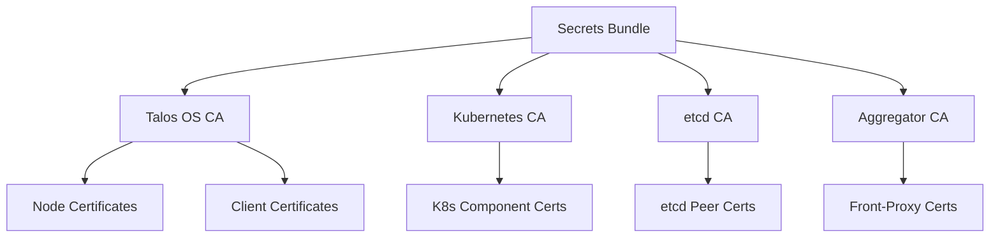

Talos uses a comprehensive Public Key Infrastructure (PKI) to secure all communications and establish cryptographic identity for nodes and clients. This page explains the certificate architecture and management.

## PKI Architecture

Talos implements a multi-tier PKI with separate Certificate Authorities (CAs) for different subsystems:



### Why Multiple CAs?

Using separate CAs provides security isolation:

- **Blast radius containment** - Compromise of one CA doesn't affect others
- **Role separation** - Different systems use different trust anchors
- **Independent rotation** - CAs can be rotated independently
- **Compliance** - Meets security standards requiring separation of duties

## Certificate Authorities

Talos generates and manages five separate CAs:

### 1. Talos OS CA

**Purpose:** Authenticates clients and nodes for Talos API access

**Generated in:** `pkg/machinery/config/generate/secrets/ca.go:54`

**Properties:**
- Organization: `talos`
- Validity: 10 years (87,600 hours)
- Algorithm: RSA or ECDSA
- Used for: Client certificates, node server certificates

**Signs:**
- `talosctl` client certificates with roles (`os:admin`, `os:operator`, `os:reader`)
- Node server certificates for the apid service
- Admin certificates for cluster access

### 2. Kubernetes CA

**Purpose:** Authenticates Kubernetes control plane components

**Generated in:** `pkg/machinery/config/generate/secrets/ca.go:29`

**Properties:**
- Organization: `kubernetes`
- Validity: 10 years
- Algorithm: ECDSA (default)
- Used for: kube-apiserver, kubelet, controller-manager, scheduler

**Signs:**
- API server certificates
- Kubelet client and server certificates
- Controller manager and scheduler certificates

### 3. etcd CA

**Purpose:** Secures etcd cluster communication

**Generated in:** `pkg/machinery/config/generate/secrets/ca.go:17`

**Properties:**
- Organization: `etcd`
- Validity: 10 years
- Algorithm: ECDSA (default)
- Used for: etcd peer and client communication

**Signs:**
- etcd peer certificates (inter-node communication)
- etcd client certificates (control plane access to etcd)

### 4. Kubernetes Aggregator CA

**Purpose:** Secures Kubernetes API aggregation layer

**Generated in:** `pkg/machinery/config/generate/secrets/ca.go:41`

**Properties:**
- Common Name: `front-proxy`
- Validity: 10 years
- Algorithm: ECDSA (default)
- Used for: Front-proxy client authentication

**Signs:**
- Front-proxy client certificates for API aggregation

### 5. Kubernetes Service Account Key

**Purpose:** Signs Kubernetes service account tokens

**Generated in:** `pkg/machinery/config/generate/secrets/bundle.go:241`

**Properties:**
- Type: RSA (legacy) or ECDSA key pair
- Not a CA (just a signing key)
- Used for: Signing and verifying service account JWT tokens

## Certificate Types

### Client Certificates

Used by `talosctl` to authenticate to Talos nodes:

**Structure:**
```
Subject: CN=talosctl-client
Organization: os:admin (or os:operator, os:reader)
Key Usage: Digital Signature
Extended Key Usage: Client Authentication
Validity: 365 days (default)
```

**Generated in:** `pkg/machinery/config/generate/secrets/ca.go:65`

The organization field determines the role:
- `os:admin` - Full access to all APIs
- `os:operator` - Management operations without secret access
- `os:reader` - Read-only access to non-sensitive APIs
- `os:etcd:backup` - Permission to create etcd backups

<Note>
Client certificates are short-lived (365 days by default) to limit the impact of credential compromise. See `pkg/machinery/constants` for `TalosAPIDefaultCertificateValidityDuration`.
</Note>

### Server Certificates

Used by Talos nodes to secure the API endpoint:

**Structure:**
```
Subject: CN=talos-node
SAN: IP:10.0.0.1, IP:192.168.1.1 (node IPs)
Key Usage: Digital Signature, Key Encipherment
Extended Key Usage: Server Authentication
```

The Subject Alternative Names (SANs) include:
- All non-loopback IP addresses on the node
- Additional SANs specified in `machine.certSANs` configuration

### Node Certificates

Generated during bootstrap and renewed automatically:

1. Node requests a certificate from trustd
2. trustd validates the bootstrap token
3. trustd issues a short-lived certificate
4. Node uses certificate for API operations
5. Certificate is renewed before expiration

## Secrets Bundle

The secrets bundle contains all PKI material for a cluster:

**Structure (from `pkg/machinery/config/generate/secrets/secrets.go`):**

```yaml
Cluster:
  Id: "<base64-encoded-cluster-id>"
  Secret: "<base64-encoded-cluster-secret>"

Secrets:
  BootstrapToken: "<token-id>.<token-secret>"  # Format: 6.16 chars
  SecretboxEncryptionSecret: "<base64-key>"     # For etcd encryption

TrustdInfo:
  Token: "<bootstrap-token>"  # For initial node authentication

Certs:
  Etcd:
    Crt: "<base64-pem-cert>"
    Key: "<base64-pem-key>"
  K8s:
    Crt: "<base64-pem-cert>"
    Key: "<base64-pem-key>"
  K8sAggregator:
    Crt: "<base64-pem-cert>"
    Key: "<base64-pem-key>"
  K8sServiceAccount:
    Key: "<base64-pem-key>"
  OS:
    Crt: "<base64-pem-cert>"
    Key: "<base64-pem-key>"
```

**Generation:**

```bash
# Generated automatically during 'talosctl gen config'
talosctl gen config my-cluster https://controlplane:6443

# Or explicitly with 'talosctl gen secrets'
talosctl gen secrets -o secrets.yaml
```

<Warning>
The secrets bundle contains all private keys for the cluster. Store it securely:
- Encrypt at rest
- Limit access to authorized personnel only
- Never commit to version control
- Use secure secret management (Vault, SOPS, etc.)
</Warning>

## Certificate Management

### Bootstrap Process

When a new node joins the cluster:

1. **Initial Trust**: Node is configured with:
   - `machine.token` - Bootstrap token for authentication
   - `machine.ca` - Talos OS CA certificate

2. **Certificate Request**: Node sends CSR to trustd service

3. **Validation**: trustd validates the bootstrap token

4. **Issuance**: trustd signs the CSR and returns certificate

5. **Renewal**: Node automatically renews before expiration

**Config example:**

```yaml
machine:
  # Bootstrap token for initial authentication
  token: "328hom.uqjzh6jnn2eie9oi"
  
  # Talos OS CA certificate
  ca:
    crt: LS0tLS1CRUdJTiBDRVJUSUZJQ0FURS0tLS0t...
    key: LS0tLS1CRUdJTiBSU0EgUFJJVkFURSBLRVkt...
```

### Certificate Rotation

Talos handles certificate rotation automatically:

**Node Certificates:**
- Automatically renewed before expiration
- No manual intervention required
- Rotation is transparent to workloads

**Client Certificates:**
- Must be regenerated manually
- Default validity: 365 days
- Generate new certificates with `talosctl config new`

**CA Rotation:**

Rotating CAs requires more planning:

1. **Add New CA**: Configure `machine.acceptedCAs` with new CA
2. **Wait for Propagation**: Ensure all nodes trust new CA
3. **Issue New Certificates**: Sign new certificates with new CA
4. **Replace Old CA**: Update `machine.ca` to new CA
5. **Remove Old CA**: After all certificates are replaced

<Note>
CA rotation is a multi-step process to maintain cluster availability. Use `machine.acceptedCAs` to trust both old and new CAs during transition.
</Note>

### Accepted CAs

Talos supports multiple trusted CAs for rotation:

**Configuration:**

```yaml
machine:
  # Current issuing CA
  ca:
    crt: LS0tLS1CRUdJTi...
    key: LS0tLS1CRUdJTi...
  
  # Additional trusted CAs (certificate only, no key)
  acceptedCAs:
    - crt: LS0tLS1CRUdJTi...  # Old CA still trusted
    - crt: LS0tLS1CRUdJTi...  # Another trusted CA
```

**Use cases:**
- CA rotation without downtime
- Multi-datacenter deployments with separate CAs
- Gradual migration to new PKI

See `pkg/machinery/config/types/v1alpha1/v1alpha1_types.go:254` for the config structure.

## Certificate Inspection

### View Client Certificate

Inspect your talosconfig certificate:

```bash
# Extract certificate from talosconfig
talosctl config info --base64=false | \
  yq '.contexts[.context].crt' | \
  base64 -d | \
  openssl x509 -noout -text
```

**Expected output:**
```
Certificate:
    Subject: CN=talosctl-client
    Subject: O=os:admin
    Validity:
        Not Before: Jan  1 00:00:00 2024 GMT
        Not After : Jan  1 00:00:00 2025 GMT
    X509v3 Extended Key Usage:
        TLS Web Client Authentication
```

### View Node Certificate

Inspect a node's server certificate:

```bash
# Connect and view certificate
echo | openssl s_client -connect <node-ip>:50000 2>/dev/null | \
  openssl x509 -noout -text
```

### Verify Certificate Chain

Validate a certificate against the CA:

```bash
# Extract CA from secrets bundle
yq '.Certs.OS.Crt' secrets.yaml | base64 -d > ca.crt

# Extract client cert from talosconfig
talosctl config info --base64=false | \
  yq '.contexts[.context].crt' | \
  base64 -d > client.crt

# Verify
openssl verify -CAfile ca.crt client.crt
```

## Troubleshooting

### Certificate Expired

**Symptoms:**
```
failed to connect: x509: certificate has expired
```

**Resolution:**

For client certificates:
```bash
# Generate new talosconfig
talosctl gen config my-cluster https://controlplane:6443 \
  --with-secrets secrets.yaml \
  --output-types talosconfig
```

For node certificates:
- Nodes automatically renew certificates
- If renewal fails, check trustd service logs: `talosctl logs trustd`

### Certificate Verification Failed

**Symptoms:**
```
failed to verify certificate: x509: certificate signed by unknown authority
```

**Resolution:**

1. Verify you're using the correct talosconfig
2. Check that `machine.ca` matches the signing CA
3. Ensure CA certificate is valid:

```bash
# Check CA expiration
yq '.Certs.OS.Crt' secrets.yaml | base64 -d | \
  openssl x509 -noout -dates
```

### Missing Client Auth Extended Key Usage

**Symptoms:**
```
certificate is missing the client auth extended key usage
```

**Resolution:**

The certificate was not generated for client authentication. Regenerate:

```bash
talosctl gen config my-cluster https://controlplane:6443 \
  --with-secrets secrets.yaml \
  --output-types talosconfig
```

See `internal/app/apid/main.go:265` for the enforcement of this check.

## Best Practices

### Certificate Validity

- Use short-lived certificates (365 days or less)
- Implement automated renewal processes
- Monitor certificate expiration dates

### CA Protection

- Store CA private keys in secure, encrypted storage
- Limit access to CA keys to essential personnel
- Consider using HSM for CA key storage in production
- Implement audit logging for CA operations

### Certificate Distribution

- Use secure channels to distribute certificates
- Rotate certificates if compromise is suspected
- Implement certificate revocation if needed

### Monitoring

Monitor certificate health:

```bash
# Check when certificates expire
talosctl get certificatestatus -n <node>

# View security state
talosctl get securitystatus -n <node>
```

## Advanced Topics

### Custom CA

You can use existing CAs instead of generating new ones:

```bash
# Create secrets bundle from existing Kubernetes PKI
talosctl gen secrets --from-kubernetes-pki /etc/kubernetes/pki
```

See `pkg/machinery/config/generate/secrets/bundle.go:60` for implementation details.

### Certificate Renewal Configuration

Certificate renewal is automatic but can be observed:

```bash
# View certificate renewal status
talosctl get certificatestatus -n <node>
```

### Offline Certificate Generation

Generate certificates for air-gapped environments:

```bash
# Generate all secrets offline
talosctl gen secrets

# Use secrets to generate configs
talosctl gen config my-cluster https://controlplane:6443 \
  --with-secrets secrets.yaml
```

## Related Resources

<CardGroup cols={2}>
  <Card title="Authentication" icon="key" href="/security/authentication">
    Learn about mTLS authentication and talosconfig
  </Card>
  <Card title="Security Overview" icon="shield" href="/security/overview">
    Understand the overall security model
  </Card>
</CardGroup>
